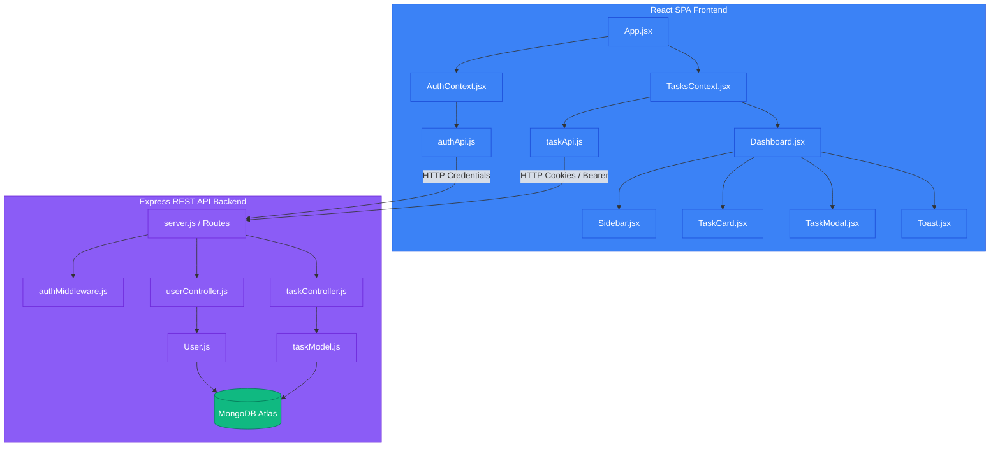

# Task Tracker - Premium MERN Stack Web Application

A modern, highly responsive, and visually stunning MERN stack task management application designed for seamless daily workflow organization. Built with custom glassmorphic styling, robust database integration, and high-performance server-side query management.

---

## 🚀 Key Features

* **Secure Authentication**: Register and login securely. Uses JSON Web Tokens (JWT) stored in HTTP-Only cookies to protect against Cross-Site Scripting (XSS) attacks.
* **Full CRUD Operations**: Create, view, edit, and delete tasks dynamically.
* **Server-side Search & Query Processing**:
  * **Status Filtering**: Instantly display tasks by category (Pending, In Progress, Completed).
  * **Global Text Search**: Query-matched title and description search across the entire database.
  * **Dynamic Sorting**: Toggle list orders between "Newest First" and "Oldest First" database-wide.
  * **Page-based Pagination**: Smooth database pagination (limit of 6 items per page) to optimize bandwidth.
* **Real-time Analytics Panel**: Completion rate tracking with animated progress bars reflecting live task distributions.
* **Overdue Alerts**: Automatic visual warnings (red highlight and indicator) for tasks whose due date has passed.
* **Dynamic Feedback**: Customized Toast system displaying operational messages (success, warning, error, info).
* **Responsive Sidebar & Mobile View**: Adaptive drawer menu layout with blur backdrop overlay on small screens.

---

## 🏗️ System Architecture

The application separates concerns cleanly into a **Vite-powered React SPA** on the frontend, an **Express REST API** on the backend, and a cloud-hosted **MongoDB database**.



---

## 🛠️ Technology Decisions (Design Rationale)

1. **Framework Choice**: **Vite + React** provides hot-module reloading and highly optimized build pipelines for a fast single-page experience.
2. **State Management**: **React Context API** handles user authentication and task CRUD globally. State actions propagate updates dynamically across visual widgets (e.g. updating a task status updates the category badge count, completion rate, and list order without page refreshes).
3. **Database Selection**: **MongoDB** is used due to its flexible JSON-document schema. The schema utilizes MongoDB timestamps for creation/update tracking, and references user ObjectIds to isolate user histories.
4. **Aesthetics & Styling**: **Vanilla CSS Custom Properties (CSS variables)** is used for custom styling rather than TailwindCSS. Glassmorphism overlays (`backdrop-filter: blur`), dark-blue palettes, dynamic gradients, and custom slide-in animations give it a premium interface look.
5. **No-Refresh Server Queries**: Filter, search, and sort options are synced to state hooks. Setting any parameter resets the pagination offset and retrieves targeted database queries from the backend seamlessly.

---

## 📝 REST API Specifications

### Authentication Routes
* `POST /api/users/register` - Registers a new user. Hash password with bcrypt and set token cookie.
* `POST /api/users/login` - Authenticates a user. Validates credentials and returns JWT cookie.
* `POST /api/users/logout` - Clears the JWT session cookie.
* `GET /api/users/me` - Resolves the current session details (requires JWT verification).

### Task Routes
* `GET /api/tasks` - Retrieves paginated tasks matching queries.
  * **Query Params**: `status`, `page`, `limit`, `search`, `sortBy`
* `GET /api/tasks/stats` - Fetches database-wide count statistics (`total`, `pending`, `progress`, `completed`).
* `POST /api/tasks` - Creates a new task object (requires `title`).
* `PUT /api/tasks/:id` - Updates specific fields of an existing task.
* `DELETE /api/tasks/:id` - Removes a task permanently from the database.

---

## 🔧 Installation & Local Setup

### Prerequisites
* [Node.js](https://nodejs.org/) (v16+ recommended)
* MongoDB database instance (local or [MongoDB Atlas](https://www.mongodb.com/cloud/atlas))

### Step 1: Clone the Repository
```bash
git clone https://github.com/SahilSameer18/task-tracker.git
cd task-tracker
```

### Step 2: Configure Backend Server
1. Navigate into the `server` directory and install dependencies:
   ```bash
   cd server
   npm install
   ```
2. Create a `.env` file in the `server` root:
   ```env
   PORT=3000
   MONGO_URI=your_mongodb_connection_uri
   JWT_SECRET=your_jwt_signature_secret
   CLIENT_URL=http://localhost:5173
   NODE_ENV=development
   ```
3. Launch the development server:
   ```bash
   npm run dev
   ```

### Step 3: Configure Frontend Client
1. Open a new terminal window, navigate into the `client` directory and install dependencies:
   ```bash
   cd client
   npm install
   ```
2. Create a `.env` file in the `client` root:
   ```env
   VITE_API_URL=http://localhost:3000/api
   ```
3. Launch the React development client:
   ```bash
   npm run dev
   ```
4. Access the web application in your browser at `http://localhost:5173`.
